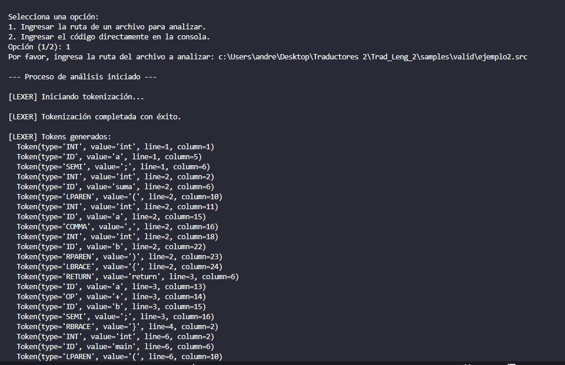
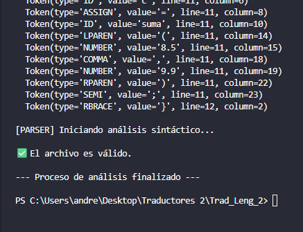

# Compilador

## Descripción del Proyecto
Este proyecto implementa un analizador léxico y sintáctico para un lenguaje de programación simple. El objetivo es procesar código fuente, identificar tokens válidos y verificar que la estructura del programa cumpla con las reglas gramaticales definidas.

---

## Análisis Léxico
El analizador léxico (implementado en `lexer.py`) se encarga de dividir el código fuente en unidades léxicas o *tokens*. Estos tokens representan las palabras clave, identificadores, operadores, literales y otros elementos del lenguaje.

### Tokens Soportados
- **Palabras clave**: `program`, `var`, `int`, `float`, `string`, `print`, `return`
- **Identificadores**: Nombres de variables y funciones.
- **Operadores**: `+`, `-`, `*`, `/`
- **Símbolos**: `;`, `:`, `,`, `{`, `}`, `(`, `)`
- **Literales**: Números (`int` y `float`) y cadenas de texto.

### Manejo de Errores Léxicos
Si el analizador encuentra un carácter inesperado, lanza un error léxico indicando la línea y columna donde ocurrió el problema.

---

## Análisis Sintáctico
El analizador sintáctico (implementado en `parser.py`) verifica que los tokens generados por el analizador léxico sigan las reglas gramaticales del lenguaje. Estas reglas definen cómo deben estructurarse los programas válidos.

### Reglas Principales
1. **Programa Principal**:
   ```
   program IDENTIFIER {
       ...declaraciones y sentencias...
   }
   ```
2. **Declaraciones de Variables**:
   ```
   var IDENTIFIER : TYPE;
   ```
3. **Declaraciones de Funciones**:
   ```
   TYPE IDENTIFIER(PARAMS) {
       ...cuerpo de la función...
   }
   ```
4. **Sentencias**:
   - Asignaciones: `IDENTIFIER = EXPRESSION;`
   - Llamadas a funciones: `IDENTIFIER(PARAMS);`
   - Impresión: `print(EXPRESSION);`
   - Retornos: `return EXPRESSION;`

### Manejo de Errores Sintácticos
Si se encuentra un token inesperado, el analizador registra un error indicando qué se esperaba y qué se encontró, junto con la ubicación del error.

---

## Estructura del Proyecto
- `main.py`: Punto de entrada del programa. Permite al usuario analizar un archivo o ingresar código directamente.
- `lexer.py`: Implementa el analizador léxico.
- `parser.py`: Implementa el analizador sintáctico.
- `samples/`: Contiene ejemplos de código fuente para probar el analizador.

---

## Cómo Usar
1. Ejecuta el programa:
   ```
   python main.py
   ```
2. Selecciona una opción:
   - **1**: Proporcionar la ruta de un archivo para analizar.
   - **2**: Ingresar el código directamente en la consola.
3. Revisa los resultados:
   - Tokens generados por el analizador léxico.
   - Validación sintáctica y errores (si los hay).

---

## Ejemplo de Código Válido
```
program ejemplo {
    var x: int;
    var y: float;

    int suma(int a, int b) {
        return a + b;
    }

    void main() {
        x = 10;
        y = 20.5;
        print suma(x, y);
    }
}
```

---

## Terminal
A continuación, se muestran capturas de pantalla de la ejecución del programa en la terminal:

### Captura 1


### Captura 2

